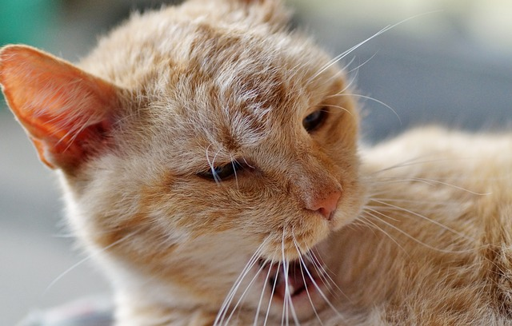

```{r setup, include=FALSE}
library(learnr)
library(gradethis)

knitr::opts_chunk$set(
	echo = FALSE,
	message = FALSE,
	warning = FALSE
)

knitr::knit_engines$set("html") # for linux machines

source("../R/helper_code.R")

# Check whether required packages are installed
pkgs <- matrix(c(
  "data.table", "1.12.0", "CRAN",
  "learnr", "0.10.0", "CRAN",
  "gradethis", "0.2.3.9001", "rstudio/gradethis",
  "outliertree", "1.7.4", "CRAN"
), byrow = TRUE, ncol = 3) |> 
  as.data.frame() |> 
  setNames(c("pkg", "version", "where"))

check_pkgs <- function(.pkgs = pkgs) {
  bootcamp2021:::check_packages(.pkgs)
}

# RStudio, at least 4.1717
check_RStudio <- function(x = 4.1717) {
  bootcamp2021:::check_rstudio(x)
}


# R check version (required 4.1.1)
check_R <- function(x) {
  bootcamp2021:::check_r_equal(4, 1.1)
}
```

```{css, echo = FALSE}
.tip {
  border-radius: 10px;
  padding: 10px;
  border: 2px solid #136CB9;
  background-color: #136CB9;
  background-color: rgba(19, 108, 185, 0.1);
  color: #2C5577;
}

.warning {
  border-radius: 10px;
  padding: 10px;
  border: 2px solid #f3e2c4;
  background-color: #f3e2c4;
  background-color: rgba(243, 226, 196, 0.1);
  color: #775418;
}

.infobox {
  border-radius: 10px;
  padding: 10px;
  border: 2px solid #868e96;
  background-color: #868e96;
  background-color: rgba(134, 142, 150, 0.1);
  color: #2F4F4F;
}
```

```{html, echo = FALSE}
<style>
pre {
  white-space: pre-wrap;
  background: #F5F5F5;
  max-width: 100%;
  overflow-x: auto;
}
</style>
```

## Introduction

We are going to become friends with our data.

It is quite odd. We are **data** scientists, but really spend most time with our
models, neglecting the data themselves.

If we care for our data, our data will care for us.

So, let's introduce ourselves to our data and become friends. Your models will
thank you for it.

> # **R-thur says: *LET'S GO*!**


## Checking installation

Before we run these tutorials, we first quickly make sure you have all of the
required packages installed for this tutorial.

### R Version

You need to have installed R version 4.1.1 and this tutorial is going to check
it for you. Please hit the `Run Code` button.

```{r r_check, echo = TRUE, include = TRUE, exercise = TRUE}
check_R()
```

### R Studio Version

You need to have installed RStudio version 1.4.1717 or above. Let's check by
clicking `Run Code`:

```{r rstudio_check, echo = TRUE, include = TRUE, exercise = TRUE}
check_RStudio()
```

### Packages

You need to have a few packages installed. Click the `Run Code` to check. It
will check whether you have the required packages installed and will attempt to
install any missing packages in case there are any.

```{r package_check, echo = TRUE, include = TRUE, exercise = TRUE}
check_pkgs()
```

## Guided example

Let's look at the `animals` dataset that is included with `bootcamp2021`. This
is a very well-known dataset, that includes data for 40 species of mammals. The
data were used for analyzing the relationship between constitutional and
ecological factors and sleeping in mammals. Two qualitatively different sleep
variables (*dreaming* and *non dreaming*) were recorded. Constitutional
variables such as *life span*, *body weight*, *brain weight* and *gestation
time* were evaluated. Ecological variables such as severity of *predatio*n,
*safety of sleeping place* and *overall danger* were inferred from field
observations in the literature.

Let's see if we are awake enough to get our hands dirty with these data.



Let's load the `sleep` data from the `bootcamp2021` package and do the Big Five
(ie. Five Number Summary) on it.

```{r laad_sleep, include=FALSE}
sleep <- bootcamp2021::sleep
```

```{r big5, echo = TRUE, include = TRUE, exercise = TRUE}

```

```{r big5-solution}
data(sleep, package = "bootcamp2021")
summary(sleep)
```

And create an overview table, with desciptives such as the mean, standard
deviation, minimum, maximum, median, and the number of valid observations.

```{r sleep_tab1, echo = TRUE, include = TRUE, exercise = TRUE, exercise.setup = "laad_sleep"}

```

```{r sleep_tab1-solution}
bootcamp2021::descriptives(sleep)
```

```{r quiz_sleep1}
quiz(
  question("If you order all observations for 'gestation' from low to high, what
           value would the observation have that is exactly in the middle?",
    answer("79", correct = TRUE, message = "Indeed, the middle observation is the median."),
    answer("142.35"),
    answer("58"),
    answer("328.5"),
    random_answer_order = TRUE,
    allow_retry = TRUE
  ),
  question("What is a trimmed mean?",
    answer("This is the mean divided by the standard deviation"),
    answer("This is the square root of the mean"),
    answer("This is the mean of the data, after removing the outliers"),
    answer("This is the mean of the data, after removing a fraction of the 
           smallest and largest observations", correct = TRUE),
    random_answer_order = TRUE,
    allow_retry = TRUE
  ),
  question("What is the 'coefficient of variation'?",
    answer("Standard deviation divided by the mean",  correct = TRUE),
    answer("Standard deviation divided by the square root of the mean"),
    answer("Variance divided by the mean"),
    answer("Variance divided by the square of the mean"),
    answer("The mean divided by the standard error"),
    random_answer_order = TRUE,
    allow_retry = TRUE
  )
)
```

### Outliers

This is a well-curated dataset, so it is unlikely that there are errors in it.
But you never know. <br> Besides, there may be unusual values in the data, even
if they are not there by error. Check for outliers using the `outliertree`
package.

```{r outliertree, echo = TRUE, include = TRUE, exercise = TRUE, exercise.setup = "laad_sleep"}

```

```{r outliertree-solution}
outliertree::outlier.tree(sleep)
```

This is just one approach. Another is to look at a boxplot of a variable. In the
box below, create some boxplots for several of the variables in the `sleep`
dataset. Play around with the arguments (remember: `?functionname`) gives you
the help file where all arguments are listed. Try some labeling of axes, add a
main title, et cetera.

```{r bw, echo = TRUE, exercise.lines = 8, include = TRUE, exercise = TRUE, exercise.setup = "laad_sleep"}


```

```{r bw-hint}
?boxplot
```

With these plots, see if you can answer the following questions.

```{r quiz_sleep2}
quiz(
  question("How many outliers do you see in the plot of 'life_span'?",
    answer("0"),
    answer("1"),
    answer("2", correct = TRUE),
    answer("A bunch, hard to count"),
    allow_retry = TRUE
  ),
  question("If you make a boxplot for 'non_dreaming - dreamin' (so, 'non_dreaming' 
           minus 'dreamin'), how many 
           outliers do you see?",
    answer("0"),
    answer("1", correct = TRUE, message = "Simply do 'boxplot(sleep$non_dreaming - sleep$dreaming)'"),
    answer("2"),
    answer("3"),
    allow_retry = TRUE
  ),
  question("How can you orient the boxplot horizontally, rather than vertically'?",
    answer("horizontal = TRUE",  correct = TRUE, message = "
           For example: boxplot(sleep$life_span, horizontal = TRUE)"),
    answer("vertical = FALSE"),
    answer("Use the 'boxplot_h' function"),
    answer("This is not possible"),
    allow_retry = TRUE
  )
)
```

### Scatterplots

Now, create a couple of scatterplots, in which you plot two variables from the
`sleep` dataset against each other. Again, play around with the options you get
to decorate the plot nicely.

```{r scatter, echo = TRUE, exercise.lines = 8, include = TRUE, exercise = TRUE, exercise.setup = "laad_sleep"}


```

```{r scatter-solution}
# Here is just one example
plot(x = sleep$dreaming, y = sleep$non_dreaming, 
     xlab = "Number of hours of dreaming sleep",
     ylab = "Number of hours of non dreaming sleep)",
     main = "Scatterplot of dreaming versus non dreaming sleep",
     pch = 16, 
     col = "blue")
abline(reg = lm(sleep$non_dreaming ~ sleep$dreaming), col = "red", lty = "dashed")
text(6.5, 15.3, label = "OLS", col = "red")
```

### Class

Check the class of the variables in the `sleep` data.frame.

```{r sleep_class, echo = TRUE, exercise.lines = 2, include = TRUE, exercise = TRUE, exercise.setup = "laad_sleep"}

```

```{r sleep_class-solution}
sapply(sleep, class)
```

### Normality

For fun, let's check for Normality for a few of the variables. Do this for
`body_wt`, `life_span`, `non_dreaming`, and `total_sleep`.

```{r sleep_shap, echo = TRUE, exercise.lines = 10, include = TRUE, exercise = TRUE, exercise.setup = "laad_sleep"}

```

```{r sleep_shap-solution}
# one example
shapiro.test(sleep$body_wt)
qqnorm(sleep$body_wt)

shapiro.test(sleep$life_span)
qqnorm(sleep$life_span)

shapiro.test(sleep$non_dreaming)
qqnorm(sleep$non_dreaming)

shapiro.test(sleep$total_sleep)
qqnorm(sleep$total_sleep)
```

Based on these results, which of these variables appears to have a Normal
distribution?

```{r quiz_sleep3}
quiz(
  question("Based on these results, which of these variables appears to have a Normal 
distribution?",
    answer("body_wt"),
    answer("life_span"),
    answer("non_dreaming", correct = TRUE),
    answer("total_sleep", correct = TRUE),
    random_answer_order = TRUE,
    allow_retry = TRUE
  )
)
```

### Correlations

It is time to check out the correlations between the variables. Do that in this
box. Be prepared to get an error. Can you figure out what went wrong? I think
you are able to solve it, by now.

Use the `cor` function to calculate the correlations between the variables. Use
`?cor` for help.

```{r sleep_cor1, echo = TRUE, include = TRUE, exercise = TRUE, exercise.setup = "laad_sleep"}

```

```{r sleep_cor1-hint-1}
# Only work with numeric variables, correlation is not defined otherwise
sleep_numeric <- sleep[, sapply(sleep, is.numeric)]
```

```{r sleep_cor1-hint-2}
# Could there be missings (NA's) in your data?
```

```{r sleep_cor1-hint-3}
# see `?cor` and look for the `use` argument
```

```{r sleep_cor1-solution}
sleep_numeric <- sleep[, sapply(sleep, is.numeric)]
round(cor(sleep_numeric, use = "pairwise.complete.obs"), digits = 2)
```

Ha, see? I knew you could do it. Hang in there!

### Correlation plots

From here on, we will be working with the `sleep_numeric` data, which we create
by only selecting the numeric variables from `sleep`:

We did this with the following code:

``` {.r}
sleep_numeric <- sleep[, sapply(sleep, is.numeric)]
```

```{r laad_sleep_num, include=FALSE}
sleep <- bootcamp2021::sleep
sleep_numeric <- sleep[, sapply(sleep, is.numeric)]
```

Now, create a plot of the correlation table, where the cells are nicely colored
according to the sign and the strength of the relation between the variables.

```{r sleep_cormat, echo = TRUE, exercise.lines = 2, include = TRUE, exercise = TRUE, exercise.setup = "laad_sleep_num"}

```

```{r sleep_cormat-solution}
bootcamp2021::corrMat(sleep_numeric, use = "pairwise.complete.obs")
```

Compare it to the correlation table you just created with `cor()`. Did you get
the same numbers? You should.

It is always nice to create a network. As I always say:

> A day without a network plot, is a day not lived.

Let's make this day successful right away by creating a networkplot from the
correlation matrix. We are not interested in small relations, so only include
those correlations in the plot that are .30 or higher (in absolute value).

```{r sleep_corplot1, echo = TRUE, exercise.lines = 2, include = TRUE, exercise = TRUE, exercise.setup = "laad_sleep_num"}

```

```{r sleep_corplot1-solution}
bootcamp2021::corrNetwork(sleep_numeric, 
                          use = "pairwise.complete.obs",
                          remove_below_abs = .3)
```

Actually, I just want to keep those correlations that are statistically
significant. Pick a significance level and remove those correlations that have a
p-value above that significance level (because that means that they are not
statistically significant).

```{r sleep_corplot2, echo = TRUE, exercise.lines = 2, include = TRUE, exercise = TRUE, exercise.setup = "laad_sleep_num"}

```

```{r sleep_corplot2-solution}
# Say, you picked alpha = .05
bootcamp2021::corrNetwork(sleep_numeric, 
                          use = "pairwise.complete.obs",
                          remove_above_p = .05)
```

A few small correlations returned, compared to the previous plot.

Of course, you can combine this. So, you could decide to only show statistically
significant correlations that are at least .3 or .4 or so.

Just try it out:

```{r sleep_corplot3, echo = TRUE, exercise.lines = 2, include = TRUE, exercise = TRUE, exercise.setup = "laad_sleep_num"}

```

```{r sleep_corplot3-solution}
# Say, you picked alpha = .05
bootcamp2021::corrNetwork(sleep_numeric, 
                          use = "pairwise.complete.obs",
                          remove_above_p = .05,
                          remove_below_abs = .4)
```

Yes, I told you: `r rproj()` is becoming second nature to you!

## Unguided assignment I

You are in luck: I have **two** assignments for you to do on your own now. I
think you'll enjoy doing them. Each is fairly small and focused.

::: {.infobox}
**This is what you do in assignment I:**

1.  load the dataset `dozen` from the `bootcamp2021` package.<br> This is a list
    with twelve datasets, each containing only two variables: `x` and `y`. The
    datasets are named; the first is called "one", the second "two", et cetera,
    all the way up to--you guessed it--"twelve".

2.  For each dataset, calculate descriptive statistics.<br> Especially focus on
    the mean (of `x` and of `y`), the standard deviation (of `x` and of `y`),
    and Pearson's correlation between `x` and `y`. Make sure you do this for
    each of the twelve datasets!

3.  Compare the results, is there something you notice about this?

4.  Make a scatterplot between `x` and `y`, again for each dataset
    separately.<br> Is there anything special you notice?
:::

If you are not sure how to work with a list, I refer you to the first lecture in
the SNA4DS course.

Besides that, here are a few tips.

You access the third dataset as

```{r laad_dozen, include=FALSE}
dozen <- bootcamp2021::dozen
```

```{r drie, echo = TRUE, exercise = TRUE, exercise.setup = "laad_dozen"}
dozen[[3]]
# same thing
dozen$three
```

You calculate the means for dataset 5 as

```{r vijf, echo = TRUE, exercise = TRUE, exercise.setup = "laad_dozen"}
mean(dozen[[5]]$x)
mean(dozen[[5]]$y)
apply(dozen[[5]], 2, mean) # in 1 line, the means for x and y are calculated
```

Or, all of the means in one swoop:

```{r means, echo = TRUE, exercise = TRUE, exercise.setup = "laad_dozen"}
lapply(dozen, apply, 2, mean)
```

I am sure you can figure out how to do calculate the standard deviations and the
correlations and how you draw the scatterplots.

Pay attention to what you see. The point of this exercise is to see the value of
visualization, beyond just looking at the raw numbers.

## Unguided assignment II

This final assignment is entirely free format.

::: {.infobox}
**This is what you do in assignment II:**

1.  load the dataset `loans` from the `bootcamp2021` package.<br> Make sure to
    carefully study the help page, to get familiar with the variables in this
    dataset. You can find the same info
    [here](http://openintrostat.github.io/openintro/reference/loans_full_schema.html).

2.  Pick a handful of variables that are interesting to you and might be related
    to each other.

3.  Explore the variables; look at the FiveNumber Dummary, calculate descriptive
    measures, calculate correlations, make informative plots, search for
    outliers (oh yes, there are outliers in the dataset!), et cetera. In short:
    really get to know the variables you chose.

4.  Build a regression model (or a couple of them). Make sure to look at the
    diagnostic plots after running the model. Try to find some interesting
    relations.
:::

<br><br>So, everything is now coming together. Exploratory analysis and
hypothesis testing through regression. Really cool!

You are on your way to becoming a **DATA SCIENCE SUPERSTAR**!


